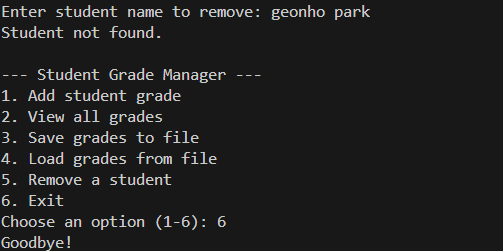

# Python Assignment – Student Manager

## Group Members
- Adetoun Adewusi – Student ID: 30149586
- Geonho park – Student ID: 
- sunhum park – Student ID: 

## Project Title
Student Manager Python Program

## Description
This Python program allows the user to manage student data. Features include:
- Add new students and their grades
- View all students
- Calculate total marks, average, and assign grades
- Save and read student data from a file

The program demonstrates:
- Functions
- Loops
- Conditionals
- Lists and dictionaries
- File handling

## How to Run
1. Clone the repository or download the files.
2. Make sure you have Python installed.
3. Run the program from the terminal:

```bash
python student_manager.py
## Sample Output




